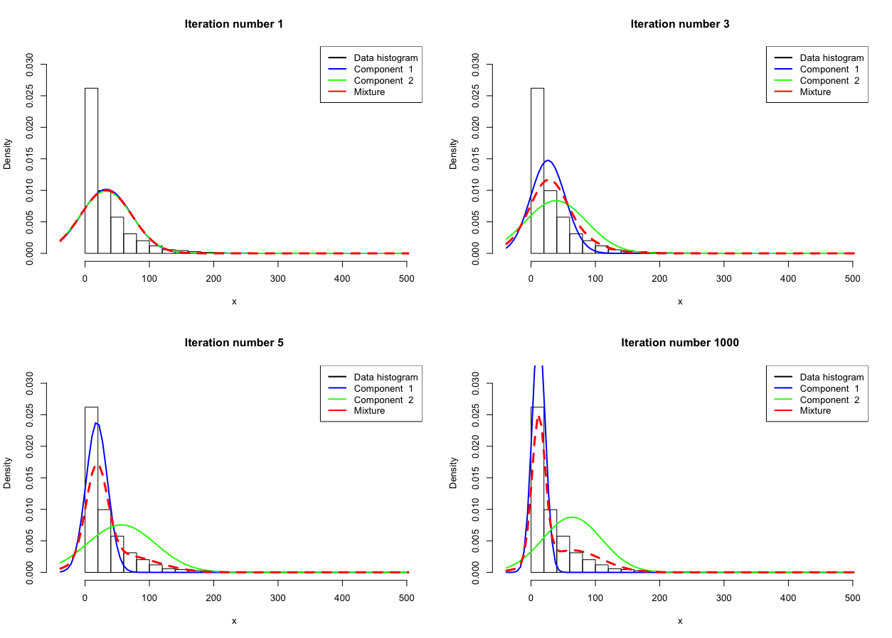
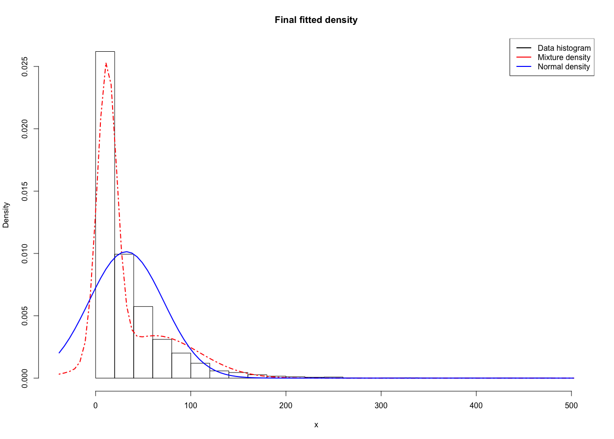
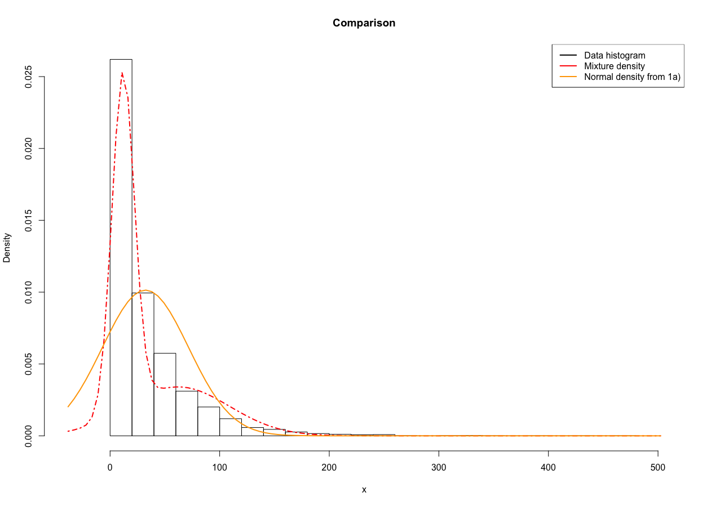

```{r setup, include=FALSE}
knitr::opts_chunk$set(
	echo = FALSE,
	message = FALSE,
	warning = FALSE
)
```

## 1

### a)

```{r}
data <-read.delim("rainfall.dat", header=FALSE, sep="\n")[,1]

#Prior values
mu_0 <- mean(data)
sigma_0 <- sd(data)
tau_0 <- 5
v_0 <- 10
n <- length(data)
iterations <- 10000 

#Prepping thetas for gibbs sampling
thetas_col <- c(rep(0,iterations))
thetas <- cbind(thetas_col,thetas_col)
thetas[1,] = c(mu_0, sigma_0^2)

#Function for draws for mu from the conditional posterior
mu_draw_cond_post <- function(sigma_2) {
	tau_n_2 <- 1/(n/sigma_2 + 1/tau_0^2)    
	raw <- (n/sigma_2) / (n/sigma_2 + 1/tau_0^2)
	mu_n <- raw*mu_0 + (1-raw) * mu_0
	return(rnorm(1,mu_n,sqrt(tau_n_2)))
}

#Fucntion for random inverse chi squared
randominvchisq <- function(vn,sigman,ndraw) {
	return(vn*sigman/rchisq(ndraw,vn))
}

#Function for draws for sigma from the conditional posterior
sigma_draw_cond_post <- function(mu) {
	v_n <-  n + v_0 #!
	sigma_n <- (v_0*sigma_0^2 + sum((data-mu)^2))/v_n #!
	return(randominvchisq(v_n,sigma_n,1))
}

#Function for draws from the h
gibbs_draw <- function(theta_n) {
	
	mu <- mu_draw_cond_post(theta_n[2])
	sigma_2 <- sigma_draw_cond_post(mu)
	return(c(mu,sigma_2))
}


#Draws for the set number of observations. First is already set above, hence we start at 2
for (i in 2:iterations) {
	thetas[i,] <- gibbs_draw(thetas[i-1,])
}

plot(thetas[,1], type="l", main="Mu")

hist(thetas[,1], main="Mu")
```

As one can see above the values from the Gibbs model varies as it simulates $\mu$ for the joint posterior.

```{r}
plot(thetas[,2], type="l", main="Sigma squared")
```


```{r}

hist(thetas[,2], main="Sigma squared")
```

As one can see above the values from the Gibbs model varies as it simulates $\sigma^2$ for the joint posterior.


### b)



The plots above shows iteration 1, 3, 5 and 1000 of the Gibbs sampling data augmentation algorithm. As one can see it starts at the same place, but as it iterates it splits into two normal distributions, each describing a part of the data well. The combined value of this can be seen in the dashed red line showing the Mixture normal model.



The plot above shows the final fitted version of the mixture model as well as a normal distribution based on the mean and variance of the original data.

### c)
 


The plot above shows the final fitted version of the mixture model as well as a normal distribution created from values from the Gibbs sampler from 1 a).

One can also see that the normal distribution based on the mean and variance of the original data is almost the exact same as the normal distribution created from values from the Gibbs sampler from 1 a).


## 2

### a)

```{r}

data <-read.table("eBayNumberOfBidderData.dat", header=TRUE)

library(glmnet)

model <- glm(nBids ~ . - Const,family=poisson, data=data)
print(model)
```

The interesting part to note in the model above are the coefficients for each variable as these will be compared to in b) and c). The ones that are most significant are MinBidShare, Sealed and VerifyID.

### b)

```{r}
# b)
library(mvtnorm)
X <- as.matrix(data[,-1])
y <- as.vector(data$nBids)
XTX_inv <- solve(t(X)%*%X)
mu = rep(0,ncol(X))
initBeta <- as.vector(rmvnorm(1,mean=rep(0,nrow(XTX_inv)),sigma=(100 * XTX_inv)))


LogPostPoisson <- function(betaVect, y, X, mu, Sigma) {
	
	linPred <-  X %*% betaVect 
	lambda <- exp(linPred)

	logLik <- sum(-log(factorial(y))+y*linPred-lambda)
	
	if (abs(logLik) == Inf) 
		logLik = -20000
	# Likelihood is not finite, stear the optimizer away from here!
	
	# evaluating the prior
	logPrior <- dmvnorm(betaVect, mu, Sigma, log = TRUE)
	
	#print(logLik + logPrior)
	#print(betaVect)
	# add the log prior and log-likelihood together to get log posterior
	return(logLik + logPrior)
}


OptimResults <-
	optim(
		initBeta,
		LogPostPoisson,
		gr = NULL,
		y,
		X,
		mu,
		100 * XTX_inv,
		method = c("BFGS"),
		control = list(fnscale = -1),
		hessian = TRUE
	)


#Results 2 b)
inverse_hessian <- solve(-OptimResults$hessian)
B_tilde <- OptimResults$par

```

$J^{-1}_y(\tilde{\beta})$ is:

```{r}

print(inverse_hessian)

```

$\tilde{\beta}$ is:

```{r}

print(B_tilde)

```

### c)


```{r}


# c)

sigmaInput <- inverse_hessian
initalThetaInput <- c(rep(0,nrow(sigmaInput)))
c_Input <- 0.5
noIterationsInput <- 5000


rwmSampler <- function(logPostFunc,sigma, initalTheta,c,noIterations, ...) {

	outSteps <- matrix(nrow=noIterations, ncol = length(initalTheta))
	outSteps[1,] <- initalTheta
	
	for (i in c(2:noIterations)) {
		nextTheta <- as.vector(rmvnorm(1, outSteps[i-1,],c * sigma))
		r <- exp(logPostFunc(nextTheta,...) - logPostFunc(outSteps[i-1,],...))
		
		
		if(r > runif(1)){
			outSteps[i,] <- nextTheta
		}else{
			outSteps[i,] <- outSteps[i-1,]
		}
	}
	return(outSteps)
}


	
	steps <- rwmSampler(LogPostPoisson,sigmaInput, initalThetaInput,c_Input,noIterationsInput,y, X, mu, 100 * XTX_inv)
	
	par(mfrow=c(3,3))
	for(i in c(1:9)) {
		hist(steps[,i], main=paste("posterior beta num",i))
		
	}
		for(i in c(1:9)) {
		plot(steps[,i], type="l", main=paste("Steps for posterior beta num",i))
		
	}
	par(mfrow=c(1,1))

```

As one can see in the histograms above the MCMC converges to about the same value as the coefficients for the GLM model in a). However in the case of bayesian approch we are presented with a distrubution for $\tilde{\beta}$ rather than a singular value. The line plots show how the value for each individual beta changed with each iteration. Here the line plots are squished together for the sake of the report. In RStudio we studied each plot one by one and came to the conclusion mentioned earlier.

### d)

```{r}

#d)

b_tilde <- c()
features <- c(1,1,1,1,0,0,0,1,0.5)
for (i in c(1:9)) {
	b_tilde[i] <- median(steps[,i])
}
lambda_tilde <- exp(t(features)%*%b_tilde)

predicted_draws <- rpois(10000,lambda_tilde)

hist(predicted_draws, main="Predicitve distribution",xlab="Number of bidders")

prob_for_zero_bidders <- sum(ifelse(predicted_draws==0,1,0))/(length(predicted_draws))


```


In the histogram above one can see the predicitve distribution for the number of bidders given the vector (`r features`) where the feature Const is set to 1 according to previous data. The $\tilde{\beta}$ is calculated using the median of the MCMC draws in c). Using these values and the given feature vector $\lambda$ is calculated according to $\lambda=exp(x^T\beta)$. The predictive distriibution was simulated using $y|\beta\sim Poisson[\lambda]$. Using this simulated distribution the probablility of 0 bidders was calulated to be `r prob_for_zero_bidders`.

\newpage

## Appendix for code

```{r, code=readLines("Lab_3.R"), echo=TRUE, eval=FALSE}

```

```{r, code=readLines("Lab_3_2.R"), echo=TRUE, eval=FALSE}

```
