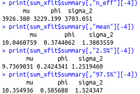
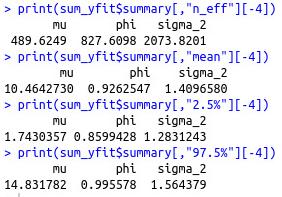
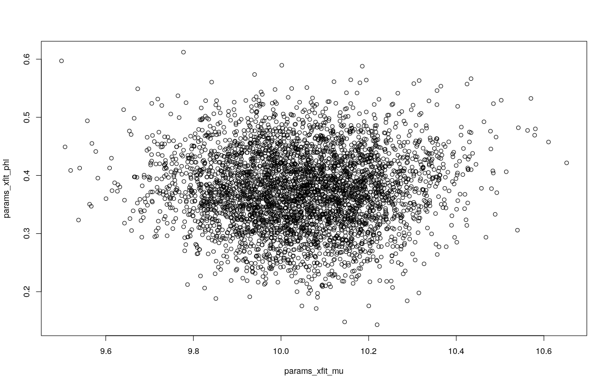
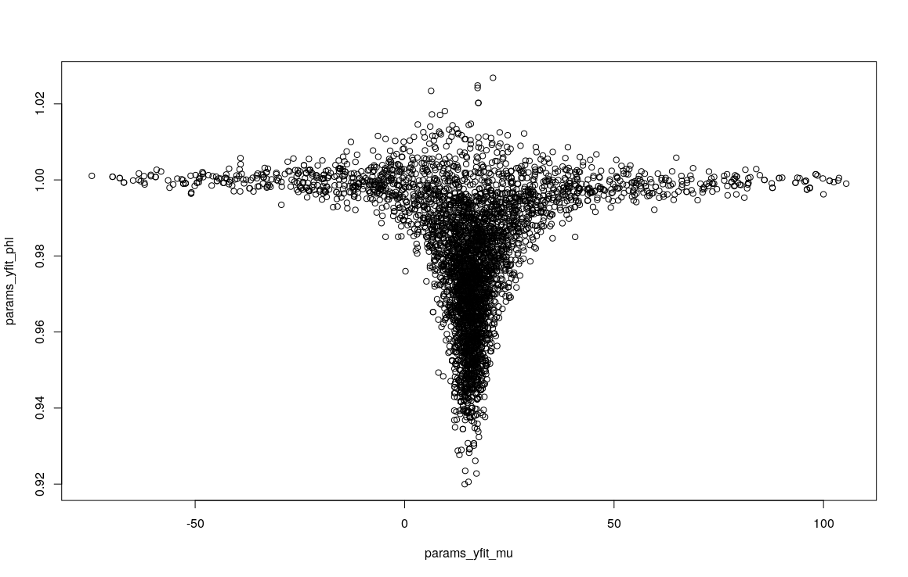
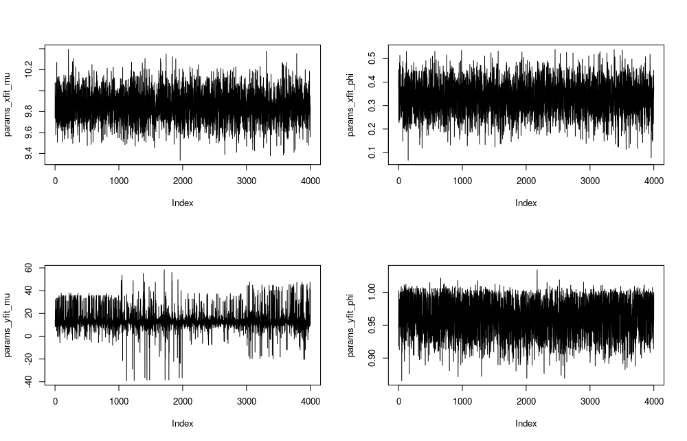
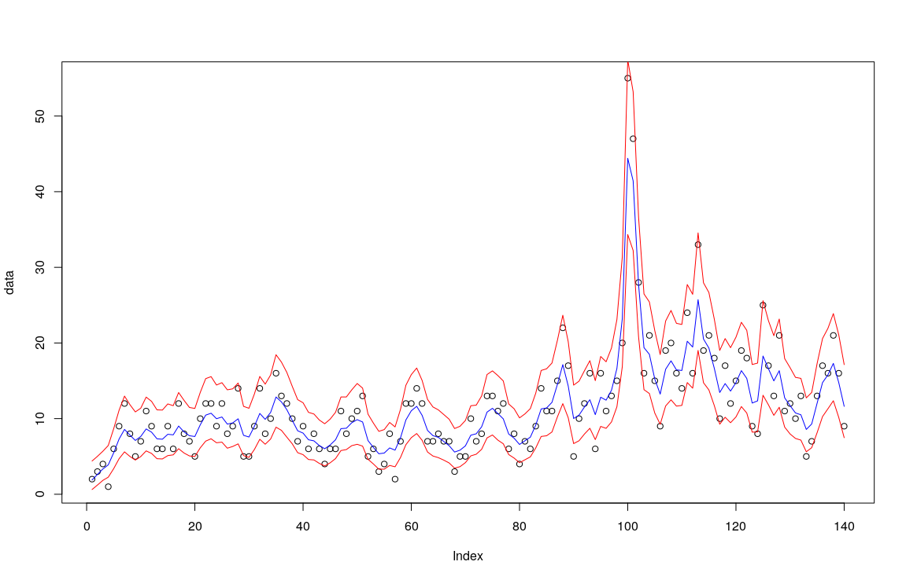
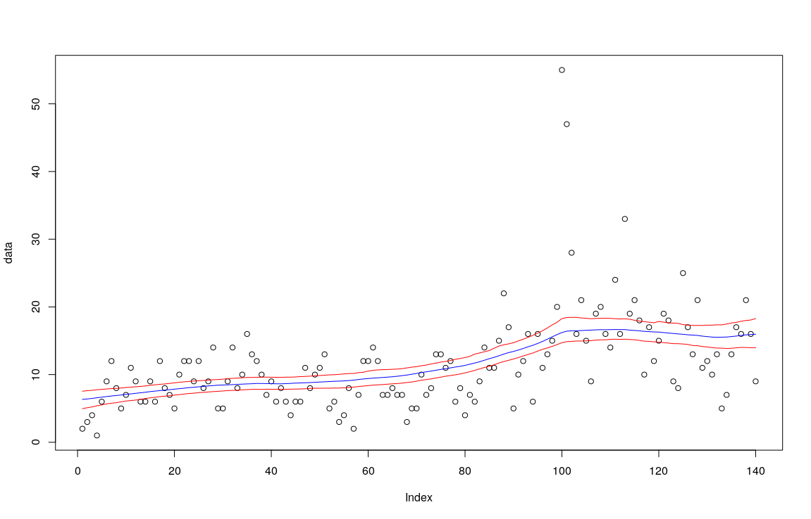

```{r setup, include=FALSE}
knitr::opts_chunk$set(
	echo = FALSE,
	message = FALSE,
	warning = FALSE
)
```

## 1

### a)

```{r}
library(ggplot2)
T <- 200
mu <- 10
sigma_2 <- 2

phi <- seq(-1,1,0.05)

AR_func <- function(mu, phi, x_prev, e_mu, e_sigma_sq) {
	err <- rnorm(1, e_mu, sqrt(e_sigma_sq))
	#print(err)
	#err <- 0
	return(mu + phi * (x_prev - mu) + err)
}


calced_val <- matrix(nrow = T,ncol=length(phi))
xt <- mu
#xt <- rnorm(1,mu,)

for (i in 1:length(phi)) {
	for (t in 1:T) {
		xt <- AR_func(mu,phi[i],xt,0,sigma_2)
		calced_val[t,i] <- xt
	}
}

df <- data.frame(calced_val)
colnames(df) <- phi
plot_df <- ggplot() +
	geom_line(aes(x=1:nrow(calced_val),y=as.matrix(df["-0.2"]),color="-0.2")) +
	geom_line(aes(x=1:nrow(calced_val),y=as.matrix(df["0.2"]),color="0.2")) +
	xlab("value of T") + ylab("xt") + labs(colour="phi =")
plot_df_2 <- ggplot() +
	geom_line(aes(x=1:nrow(calced_val),y=as.matrix(df["0.9"]),color="0.9")) +
	geom_line(aes(x=1:nrow(calced_val),y=as.matrix(df["-0.9"]),color="-0.9")) +
	xlab("value of T") + ylab("xt") + labs(colour="phi =")


plot_df


```

```{r}
plot_df_2
```


As one can see in the plot above, the observed variance of $x_t$ is lower for lower values of $\phi$. One can also see a difference between large positive and large negative values of $\phi$.

\newpage

### b)

#### i)



We are almost able to estimate the true values. As the true value of $\mu=10$, which is within the confidence interval and close to the mean. This also goes for $\sigma=\sqrt{2}$ and is estimated to be $1.38$ and $\phi=0.3$ and is estimated to be $0.375$.

\newpage



This estimation is not as good. This is particularly the case for $\mu$. $\mu$ is estimated to be about $10.5$, however the 95 % CI for $\mu$ has a lower limit of $1.74$ and an upper limit of $14.83$. Comparing this with xfit which has a 95 % CI for $\mu$ with a lower limit of $9.7$ and an upper limit of $10.35$, which is much narrower. Although, the estimation for $\sigma$ and $\phi$ is almost as good as for xfit. Here $\phi=0.95$.

\newpage

#### ii)




The plot above shows the joint posterior of $\phi$ and $\mu$ for data based on $\phi=0.3$. As one can see there is a high density in the middle of the cluster of the sampled values. The middle of the cluster is the mean of each of the paramaters, which can be seen above in i).

\newpage




The plot above shows the joint posterior of $\phi$ and $\mu$ for data based on $\phi=0.95$. Here one can see that the sampled values of $\phi$ is more uniformly distributed between about 1 and 0.9 while the majority of the sampled values for $\mu$ are all almost the same value, except a small portion of large outliers.

\newpage



\newpage

### c)



\newpage

### d)



The posterior has changed as it is smoother and outliers doesn't affect as much as it did before. The $\sigma^2\sim Scale-inv-\chi^2(N,0.1)$ where $N= \#\ of\ observations\ in\ the\ data\ set$.

\newpage

## Appendix for code

```{r, code=readLines("Lab_4.R"), echo=TRUE, eval=FALSE}

```
